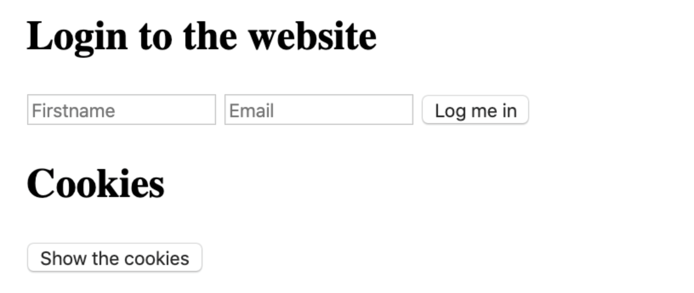
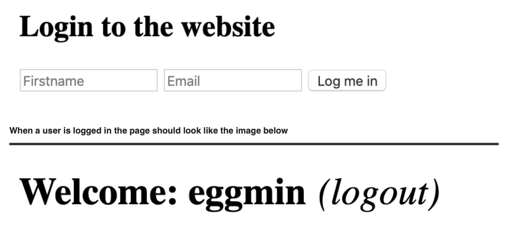

# Cookies & local storage

## 🔖 Table of contents

<details>
        <summary>
            CLICK TO ENLARGE 😇
        </summary>
        📄 <a href="#description">Description</a>
        <br>
        🎓 <a href="#objectives">Objectives</a>
        <br>
        📋 <a href="#requirements">Requirements</a>
        <br>
        📝 <a href="#instructions">Instructions</a>
        <br>
        🔨 <a href="#tech-stack">Tech stack</a>
        <br>
        📂 <a href="#files-description">Files description</a>
        <br>
        💻 <a href="#installation_and_how_to_use">Installation and how to use</a>
        <br>
        ♥️ <a href="#thanks">Thanks</a>
        <br>
        👷 <a href="#authors">Authors</a>
</details>

## 📄 <span id="description">Description</span>

This project focuses on implementing cookies, local storage, and session storage using vanilla JavaScript. It includes a series of tasks designed to enhance understanding of client-side storage techniques and their practical applications in web development.

## 🎓 <span id="objectives">Objectives</span>

At the end of this project, I had to be able to explain to anyone, **without the help of Google** :

- How to create cookies using Javascript.
- How to set specific settings for the cookie.
- How to read cookies with Javascript.
- How to use `js-cookie` for easy cookie manipulation.
- How to use the browser web storage.
- The differences between local storage and session storage.

## 📋 <span id="requirements">Requirements</span>

- All my files should end with a new line.
- A `README.md` file, at the root of the folder of the project, is mandatory.
- My code should use the js extension.
- `src/index.js` should stay empty - all my Javascript must be in my HTML, inside - `<script>` tag.

## 📝 <span id="instructions">Instructions</span>

<details>
    <summary>
        <b>0. Create basic cookie</b>
    </summary>
    <br>

**Install your development environment:**

- Install `webpack-dev-server` by running `npm install webpack-dev-server --save-dev` (if you have some errors of missing dependencies, install these packages: `npm i -D webpack` and `npm i -D webpack-cli`).
- Create an empty file `src/index.js`.
- Run your server with `node_modules/.bin/webpack-dev-server`.

**In a file 0-index.html, create a basic html template:**

- Add two text inputs, with the id `firstname` and `email`.
- Add one button with the text “Log me in” that will call the function `setCookies`.
- Add one button with the text “Show the cookies” that will call the function `showCookies`.
- Create a function `setCookies`:
    - It should set the cookie `firstname` with the value in the `firstname` input.
    - It should set the cookie `email` with the value in the `email` input.
- Create a function `showCookies`:
    - It should create a DOM element `p`.
    - It should set the inner html with `Cookies`: and the value of the cookie.
    - It should append the paragraph at the bottom of the page.

**Requirements:**

- Try to make your page to look as close to the image below as possible.

<p align="left">
    
</p>

- Access your code with `http://localhost:8080/0-index.html`.
- Use vanilla javascript to complete the task.

**Tips:**

- Make sure you have created and configured `webpack.config.js`.
- If you are using `VSCode`, you can use the plugin `live server`.

#
**Repo:**
- GitHub repository: `holbertonschool-web_front_end`.
- Directory: `Cookies_local_storage`.
- File: `src/index.js`, `package.json`, `webpack.config.js`, `0-index.html`.
<hr>
</details>

<details>
    <summary>
        <b>1. Create cookie with expiration date and specific path</b>
    </summary>
    <br>

**In a file `1-index.html`:**

- Reuse the code of the previous task.
- Modify the way you are setting cookies to expire in 10 days.

**Requirements:**

- Access your code with `http://localhost:8080/1-index.html`.
- Use vanilla javascript to complete the task.

#
**Repo:**
- GitHub repository: `holbertonschool-web_front_end`.
- Directory: `Cookies_local_storage`.
- File: `1-index.html`.
<hr>
</details>

<details>
    <summary>
        <b>2. Read cookie</b>
    </summary>
    <br>

**In a file `2-index.html`:**

- Reuse the code of the previous task.
- Create a function `getCookie`:
    - It accepts `name` as argument.
    - It should return the value of the cookie with the `name`passed in argument.
    - If the cookie does not exist, it should return an empty string.
- Modify the function `showCookies`:
    - It should display the paragraph `Email: EMAIL - Firstname: FIRSTNAME`.

**Requirements:**

- Access your code with `http://localhost:8080/2-index.html`.
- Use vanilla javascript to complete the task.

#
**Repo:**
- GitHub repository: `holbertonschool-web_front_end`.
- Directory: `Cookies_local_storage`.
- File: `2-index.html`.
<hr>
</details>

<details>
    <summary>
        <b>3. Delete cookie and mini application</b>
    </summary>
    <br>

**In a file 3-index.html, reuse your code from the previous task:**

- Add a `div` in html that will contain the login form:
    - You can reuse the one you previously wrote.
    - It has one `h2`.
    - It has two text inputs.
    - It has one button.
- Write a function named `showForm`:
    - It should remove the Welcome message if it exists.
    - It should show the form.
- Write a function named `hideForm`:
    - It should hide the form.
- Write a function named `deleteCookiesAndShowForm`:
    - It should remove the two cookies.
    - it should show the form by calling the `showForm` function.
- Write a function named `showWelcomeMessageOrForm`:
    - if user is not logged in, the function `showForm` is called.
    - If the user is logged in, replace the body of the page with a h1:
        - It should display `Welcome FIRSTNAME (logout)`.
        - `(logout)` should be a link:
            - The link font should be display in normal weight, italic, and 10px to the right of the message.
            - On click, call the function `deleteCookiesAndShowForm`, hide the welcome message, and show the form.

**Requirements:**

- Access your code with `http://localhost:8080/3-index.html`.
- Use vanilla javascript to complete the task.
- Build the Welcome message with Javascript without using HTML.

**The login form should look like the image below:**

<p align="left">
    
</p>

#
**Repo:**
- GitHub repository: `holbertonschool-web_front_end`.
- Directory: `Cookies_local_storage`.
- File: `3-index.html`.
<hr>
</details>

<details>
    <summary>
        <b>4. Use js-cookie</b>
    </summary>
    <br>

**Reusing the code from the previous task:**

- Add `js-cookie` to your html page using the `jsdelivr` CDN.
- Delete the `getCookie` function and use `js-cookie` get function instead.
- Use `js-cookie` remove function within `deleteCookiesAndShowForm` function.
- Use `js-cookie` set function within `setCookiesAndShowWelcomeMessage` function (new function that sets cookies and calls `showWelcomeMessageOrForm`).

**Requirements:**

Access your code with `http://localhost:8080/4-index.html`.
Build the Welcome message with Javascript without using HTML.
Use `js-cookie` for every cookie manipulation.

#
**Repo:**
- GitHub repository: `holbertonschool-web_front_end`.
- Directory: `Cookies_local_storage`.
- File: `4-index.html`.
<hr>
</details>

<details>
    <summary>
        <b>5. Local storage</b>
    </summary>
    <br>

**Let’s build a basic shopping cart in a new file. Setup your files with the following:**

- Create an array `availableItems` that will contain all the available items. Add the strings `Shampoo`, `Soap`, `Sponge`, and `Water` in the array.
- If Local storage is not enabled on your browser, display an alert that will contain the message `Sorry, your browser does not support Web storage. Try again with a better one.`.
- If local storage is available it should allow the user to see the application and call the function `createStore` and `displayCart`.

**Create a function addItemToCart:**

- It takes on argument `item` (string).
- It adds a key to the local storage of the name of the item, and set the value to `true`.

**Create a function createStore:**

- Create a `ul` and append it to the DOM.
- Loop through the array of items, and create a list item to add to the `ul`.
- The item should display the name of the available product.
- On click the item should call the function `addItemToCart`.

**Create a function displayCart:**

- If the local storage does not contain any item, this function does not do anything.
- If the local storage contains any item, it should display the message `You previously had X items in your cart` in a `p` element that you can append to the body.

**Tips:**

- At this time, you should be able to see the list of available items.
- If you click on two of them and refresh the browser, you should see the message `You previously had 2 items in your cart`.
- If you open a new tab, you should also see the message `You previously had 2 items in your cart`.

**Requirements:**

- Build the DOM using Javascript only.
- You must use the local storage of your browser and not a cookie or session storage.
- Access your code with `http://localhost:8080/5-index.html`.
- Build every feature with vanilla Javascript only.

#
**Repo:**
- GitHub repository: `holbertonschool-web_front_end`.
- Directory: `Cookies_local_storage`.
- File: `5-index.html`.
<hr>
</details>

<details>
    <summary>
        <b>6. Session storage</b>
    </summary>
    <br>

Reusing the code from the previous task, replace the use of local storage by session storage.

**Tips:**

- At this time, you should be able to see the list of available items.
- If you click on two of them and refresh the browser, you should see the message `You previously had 2 items in your cart`.
- If you open a new tab, you should not see any message.

**Requirements:**

- Build the DOM using Javascript only.
- You must use the session storage of your browser and not a cookie or local storage.
- Access your code with `http://localhost:8080/6-index.html`.
- Build every feature with vanilla Javascript only.

#
**Repo:**
- GitHub repository: `holbertonschool-web_front_end`.
- Directory: `Cookies_local_storage`.
- File: `6-index.html`.
<hr>
</details>

<details>
    <summary>
        <b>7. Advanced use of web storage</b>
    </summary>
    <br>

**In a new file, let’s build a more advanced cart system using Session Storage. Setup your files with the following:**

- Create an array `availableItems` that will contain all the available items. Add the strings `Shampoo`, `Soap`, `Sponge`, and `Water` to the array.
- If session storage is not enabled on your browser, display an alert that will contain the message `Sorry, your browser does not support Web storage. Try again with a better one.`.
- If session storage is available it should allow the user to see the application and call the function `createStore` and `displayCart`.

**Create a function `getCartFromStorage`:**

- It should parse a string into a JSON object, returning the content of the cart stored in Session storage.
- If there is no cart, it should return an empty object.

**Create a function `addItemToCart`:**

- It accepts `item` (string) as argument.
- It adds to the cart object the item.
- If the same item is added multiple times, the cart store the quantity.
- It stores the value of the cart object in a string for the key `cart` in the Session Storage.
- It calls `displayCart`.

**Create a function `removeItemfromCart`:**

- It accepts `item` (string) as argument.
- It remove the entire item from the cart.
- Store the value of the cart object in a string for the key `cart` in the Session Storage.
- It calls `displayCart`.

**Create a function `clearCart`:**

- It should clear the entire Session storage.
- it calls `displayCart`.

**Create a function createStore:**

- It should add a `h2` tag with the text `Available products:`.
- It should add a list with every item available for purchase.
- When the user click on an item, it should add it to the cart.

**Create a function `displayCart`:**

- It should add inside a `h2` tag with the text `Your cart:`.
- It should add an empty `div` tag.
- If the `div` tag already exist, it should remove any list child.
- It calls `updateCart`.

**Create a function `updateCart`:**

- It should add a list to the `div` tag created previously.
- If the cart is empty, it should add an item `Your cart is empty`.
- If the cart is not empty, it should add the list of items within the cart with the following format: `ITEM_NAME x QUANTITY (remove)`.
- When the user clicks on remove, it should call the function `removeItemfromCart`.
- At the top of the cart, add an item named Clear my cart. When the user clicks on it, it should call the function `clearCart`.

**Tips:**

You can look at the GIF below to see how the interaction with the different elements works:

<p align="left">
    
</p>

**Requirements:**

- Build the DOM using Javascript only
- You must use the session storage of your browser and not a cookie or local storage.
- Access your code with `http://localhost:8080/7-index.html`.
- Build every feature with vanilla Javascript only.
- `src/index.js` should stay empty - all your Javascript must be in your HTML, inside `<script>` tag.

#
**Repo:**
- GitHub repository: `holbertonschool-web_front_end`.
- Directory: `Cookies_local_storage`.
- File: `7-index.html`.
<hr>
</details>

## 🔨 <span id="tech-stack">Tech stack</span>

<p align="left">
    
    
    
    
    
</p>

## 📂 <span id="files-description">File description</span>

| **FILE**            | **DESCRIPTION**                                       |
| :-----------------: | ----------------------------------------------------- |
| `assets`            | Contains the resources required for the repository.   | 
| `src`               | Contains empty `index.js` file.                       | 
| `0-index.html`      | Basic cookie implementation.                          |
| `1-index.html`      | Cookies with expiration date.                         |
| `2-index.html`      | Read and display cookies.                             |
| `3-index.html`      | Mini application with login/logout.                   |
| `4-index.html`      | Integration of `js-cookie` library.                   |
| `5-index.html`      | Shopping cart with local storage.                     |
| `6-index.html`      | Shopping cart with session storage.                   |
| `7-index.html`      | Advanced cart system using session storage.           |
| `package.json`      | Contains project dependencies and scripts.            |
| `webpack.config.js` | Configuration file for Webpack.                       |
| `.gitignore`        | Specifies files and directories to be ignored by Git. |
| `README.md`         | The readme file you are currently reading 😉.         |

## 💻 <span id="installation_and_how_to_use">Installation and how to use</span>

**Installation:**

1. Clone this repository:
    - Open your preferred Terminal.
    - Navigate to the directory where you want to clone the repository.
    - Run the following command:

```
git clone https://github.com/fchavonet/holbertonschool-web_front_end.git
```

2. Open the repository you've just cloned.

3. Navigate to the `Cookies_local_storage` directory:

```
cd Cookies_local_storage
```

4. Install `webpack-dev-server`:

```
npm install webpack-dev-server --save-dev
```

**How to use:**

1. Run the virtual server :

```
node_modules/.bin/webpack-dev-server
```

2. Access each `.html` file in your browser to test the tasks.

3. You can also directly test the results of my work through the following links:

- [0. Create basic cookie](https://fchavonet.github.io/holbertonschool-web_front_end/Cookies_local_storage/0-index.html)
- [1. Create cookie with expiration date and specific path](https://fchavonet.github.io/holbertonschool-web_front_end/Cookies_local_storage/1-index.html)
- [2. Read cookie](https://fchavonet.github.io/holbertonschool-web_front_end/Cookies_local_storage/2-index.html)
- [3. Delete cookie and mini application](https://fchavonet.github.io/holbertonschool-web_front_end/Cookies_local_storage/3-index.html)
- [4. Use js-cookie](https://fchavonet.github.io/holbertonschool-web_front_end/Cookies_local_storage/4-index.html)
- [5. Local storage](https://fchavonet.github.io/holbertonschool-web_front_end/Cookies_local_storage/5-index.html)
- [6. Session storage](https://fchavonet.github.io/holbertonschool-web_front_end/Cookies_local_storage/6-index.html)
- [7. Advanced use of web storage](https://fchavonet.github.io/holbertonschool-web_front_end/Cookies_local_storage/7-index.html)

*Read the <a href="#instructions">instructions</a> part to  understand what was being asked of me.*

## ♥️ <span id="thanks">Thanks</span>

A big thank you to all my Holberton School peers for their help and support throughout these projects.

## 👷 <span id="authors">Authors</span>

**Fabien CHAVONET**
- Github: [@fchavonet](https://github.com/fchavonet)
